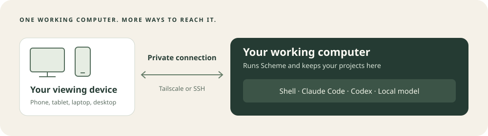
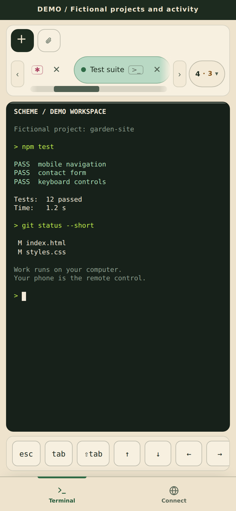
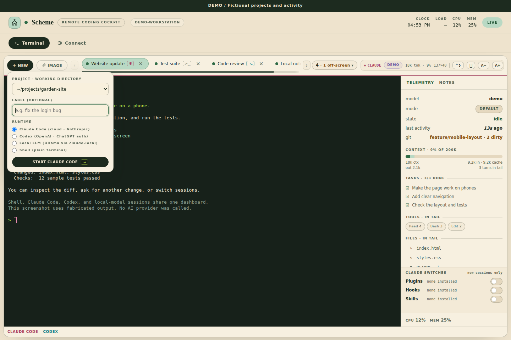
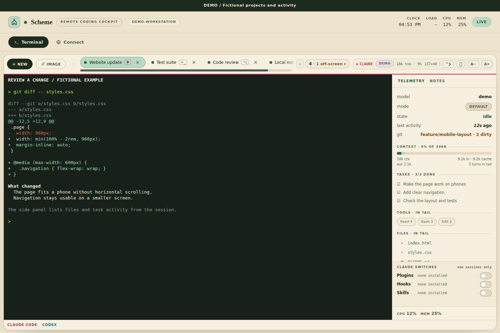

# Scheme

**Your working computer, from any screen.**

[](https://github.com/buffbeefalo/scheme/actions/workflows/tests.yml?query=branch%3Amain) [](https://github.com/buffbeefalo/scheme/actions/workflows/secrets-scan.yml?query=branch%3Amain)

*Badges show GitHub's latest reported main-branch results; they can lag and are not publication approval.*

Scheme puts a terminal and your coding tools in a dashboard you can open on a phone, tablet, laptop, or second desktop. The work runs on your own computer—such as a DGX Spark—while the other device shows the screen and sends your typing.



**[Start the setup](INSTALL-HOST.md) · [Desktop guide](INSTALL-DESKTOP.md) · [Phone guide](INSTALL-MOBILE.md) · [Get help](TROUBLESHOOTING.md)**

## New to this? Start here

You can try Scheme with a normal **Shell** terminal before installing an AI tool. Downloading the public project and trying Shell do not require a GitHub account or an AI account. Internet access is needed to download the software. Connecting through Tailscale and using cloud AI tools involve their own accounts.

1. **Set up your working computer.** Follow the [host guide](INSTALL-HOST.md). It shows how to download the ZIP, open the right folder, install the prerequisites, and start Scheme.
2. **Try a harmless command.** In Scheme, press **＋ New**, choose **Shell**, then **Start**. Type `echo "Scheme is ready"` and press Enter. You should see **Scheme is ready** in the terminal.
3. **Open it on another device.** Follow the [desktop guide](INSTALL-DESKTOP.md) or the [iPhone and Android guide](INSTALL-MOBILE.md). Both use a private Tailscale connection.
4. **Add an AI tool when you want one.** The [optional AI setup](INSTALL-HOST.md#6-add-an-ai-tool-optional) explains Claude Code, Codex, and local models.

If your second screen is a monitor plugged into the **same computer**, open <http://localhost:3000> there. A separate computer or phone needs the connection in step 3.

## A few words you will see

| Word | What it means here |
|---|---|
| **Working computer / host** | The computer that stores your projects and runs Scheme and your tools. Keep it powered on and awake. |
| **Viewing device** | The phone, tablet, or other computer where you open the dashboard. It needs a browser and a private connection; it does not need Node.js or an AI tool. |
| **Terminal / Shell** | A place to type commands that the working computer carries out. Start with the harmless example above. |
| **AI tool** | An optional assistant such as Claude Code or Codex that runs inside a terminal and can work with your project files. |
| **Tailscale / tailnet** | Software that connects your devices privately. A “tailnet” is the private network belonging to your Tailscale account. |
| **GitHub repository** | This project's folder of code and guides. The **Download ZIP** button gets a copy without using Git commands. |

## What it does

- Open several terminal tabs for Shell, Claude Code, Codex, or a local model through Ollama.
- See available session information, including whether a tool is working or waiting for you, project changes, and resource use. Some tools or versions report more detail than others.
- Reconnect after closing the browser while the working computer keeps the sessions running.
- Use the touch key bar on a phone, or keep the dashboard open on another desktop.
- Upload a file to a session's project and open a tool's links on your viewing device.

The same web dashboard adapts to desktop and phone screens. No separate Scheme phone app is required.

The **Telemetry** panel shows the last observed approval setting and, for Codex, a separately labelled sandbox mode. Codex `never` disables approval requests; restricted operations can still fail. Claude `bypassPermissions` bypasses runtime permission checks. A session can have approval prompts disabled while its sandbox stays read-only, and questions can remain pending. These observations can lag; **not reported** means the available session telemetry has no usable value, while unfamiliar values say **unrecognized**. They do not establish user authorization or remove filesystem, network, or other platform restrictions. On smaller screens, open **Tools**, press **◧** (Toggle telemetry), and use **×** to close the panel.

## See the dashboard

These are screenshots of Scheme with **fictional demonstration data**. They contain no live account, private project, or real agent conversation. The demonstration shows the interface; it is not evidence of a live AI response.


*Desktop: terminal tabs, session activity, and room to keep a project open on another screen.*

<details>
<summary>Phone layout and touch controls</summary>



The same dashboard fits a phone screen, with a touch key bar and bottom navigation. [Open the full phone screenshot](docs/images/scheme-mobile-demo.png).

</details>

<details>
<summary>Choose Shell or an installed AI tool</summary>



Start with Shell, then choose an AI tool after installing it on the working computer.

</details>

<details>
<summary>Follow file activity while a session works</summary>



The side rail lists reported file activity; the terminal shows a sample diff. This is not a separate graphical diff editor.

</details>

## What you need

| On the working computer | On the viewing device |
|---|---|
| Node.js 22 or newer, tmux 3.x, and `script`. The [host guide](INSTALL-HOST.md) covers installation. | A current web browser. For the recommended remote connection, install Tailscale too. |
| Linux has been tested. DGX Spark uses the Linux path. macOS and Windows through WSL2 have instructions, but still need host verification. | Windows, macOS, Linux, iPhone, iPad, or Android can act as the viewing device. Actual browser behavior can vary. |
| An AI tool only if you want an AI session. Local models need substantial additional memory and disk space. | No Scheme server, Node.js, coding assistant, or local model installation. |

Scheme has no npm package dependencies and no build step. Cloud tools use **your own** account, access, and billing; Scheme does not provide subscriptions or shared credentials. A downloaded local model runs on your hardware, with its own memory requirements. The tools you run can still access the internet.

## Keep your connection private

**Anyone who can use your Scheme dashboard can run commands and access files as your account on the working computer.** Use it on your own trusted devices. Scheme has no separate login screen: SSH or Tailscale supplies the access control.

Leave Scheme listening on `127.0.0.1` and follow the private connection guides. Do not expose it through a router port forward, a public reverse proxy, or Tailscale Funnel. See [Security](SECURITY.md).

Closing the browser disconnects the screen; it does not stop the work. Sleeping or shutting down the working computer stops progress. A reboot loses running processes. Scheme can attempt to reopen saved tabs and supported conversations after it starts again, but cannot restore running shell commands or unsaved process state. [Details and current recovery limits](TROUBLESHOOTING.md#after-a-disconnect-or-reboot).

## More help

| I want to… | Open this guide |
|---|---|
| Install Scheme or add my AI tools | [Working computer setup](INSTALL-HOST.md) |
| Use a second desktop or laptop | [Desktop connection](INSTALL-DESKTOP.md) |
| Use an iPhone, iPad, or Android device | [Phone and tablet connection](INSTALL-MOBILE.md) |
| Fix a setup or connection problem | [Troubleshooting](TROUBLESHOOTING.md) |
| Change the port, project list, model, or memory reserve | [Configuration](CONFIGURATION.md) |
| Report a bug or change the code | [Contributing](CONTRIBUTING.md) |
| Check a release before sharing it | [Release checks](PUBLISHING.md) |

For readers already comfortable with Git, cloning is an alternative to the ZIP download:

```bash
git clone https://github.com/buffbeefalo/scheme.git
cd scheme
bin/scheme-doctor
bin/scheme
```

Scheme is [MIT licensed](LICENSE).
