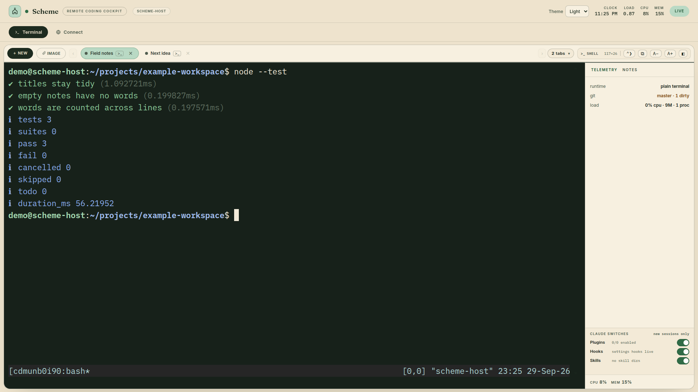
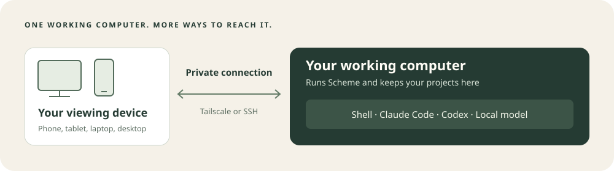

# Scheme

**Your working computer, from any screen.**

[](https://github.com/buffbeefalo/scheme/actions/workflows/tests.yml?query=branch%3Amain) [](https://github.com/buffbeefalo/scheme/actions/workflows/secrets-scan.yml?query=branch%3Amain)

Scheme puts your terminals and coding tools in a dashboard you can open from a browser. Your projects and processes stay on your own **working computer**; a laptop, second desktop, or phone provides the screen and keyboard. Start with a normal Shell, then add Claude Code, Codex, or a local model when you want one.

**[Watch the capabilities film](https://buffbeefalo.github.io/scheme/#watch) · [88-second introduction](https://buffbeefalo.github.io/scheme/#intro) · [Complete setup](https://buffbeefalo.github.io/scheme/#setup) · [Read the setup guide](INSTALL-HOST.md) · [Download v1.1.0](https://github.com/buffbeefalo/scheme/archive/refs/tags/v1.1.0.zip)**

[](https://buffbeefalo.github.io/scheme/#watch)

*Images and films show the real application on clean demonstration desktops with fictional example projects. The phone preview uses browser touch emulation. The films include English captions, chapter links, and readable transcripts.*

## One host, the screen you need



- **Keep several sessions in reach.** Use Shell, Claude Code, Codex, or the Ollama local-model lane. Search sessions by their available labels, projects, requests, and recent activity.
- **Read what your tools report.** See supported activity, context, file, and account information. Missing telemetry stays unknown; it is not treated as an idle tool or an unused account.
- **Leave the browser and return.** Sessions continue on an awake host. A tested Linux service restart also preserved a running Shell; a host reboot creates a new process.
- **Choose a comfortable view.** Auto, Light, and Dark themes adapt the surrounding dashboard. The terminal keeps its dark background so command output remains readable.
- **Work with a smaller screen.** Touch keys, a readable terminal snapshot, and a separate writing area help on narrow touch layouts. Physical phone testing remains outside this release's validation.
- **Bring in a file or follow a link.** Upload into the session's project and open supported tool links on the viewing device.

The public application has **Terminal** and **Connect**. [The capability guide](CAPABILITIES.md) explains the controls, tool requirements, and recovery limits.

## Get your first Shell running

You do not need a GitHub account or an AI account to download Scheme and try Shell. The working computer needs Node.js 22 or newer, tmux 3.x, and `script`. Scheme itself has **no npm package dependencies and no build step**.

1. **Prepare the working computer.** Follow the [host guide](INSTALL-HOST.md) to download the release, install its prerequisites, and run the setup check.
2. **Start Scheme there.** Open <http://localhost:3000> on that same computer. On an 8 GiB host, follow the guide's [1 GiB memory-reserve setting](INSTALL-HOST.md#memory-on-smaller-hosts) before opening a tab.
3. **Try Shell.** Press **＋ New**, choose **Shell**, then **Start**. Type `echo "Scheme is ready"` and press Enter. The output confirms that your browser reaches the host terminal.
4. **Connect another screen.** Use the [desktop guide](INSTALL-DESKTOP.md) for SSH or Tailscale, or the [phone guide](INSTALL-MOBILE.md) for the private Tailscale route.

If the second screen is a monitor plugged into the host, open the local dashboard there. A separate computer or phone needs a private connection; its own `localhost` address does not automatically reach the host.

## What was tested for v1.1.0

The setup was exercised on **two separate hosted graphical Ubuntu 24.04 ARM64 virtual machines**, each with 8 GiB of memory. One ran Scheme; the other viewed it through an SSH tunnel. Checks included the real Shell, browser closure and return, a Scheme service restart, and host reboot recovery. The smaller-host setup used `SYSMON_MEM_FLOOR_MB=1024`.

Cloud AI sign-ins and a real Tailscale account connection were not part of those tests. macOS and WSL host instructions are provided, but remain unverified. Responsive browser checks are not physical iPhone or Android tests. [Read the complete validation scope](CAPABILITIES.md#validation-for-v110).

## Keep the dashboard private

**Anyone who can use your Scheme dashboard can run commands and access files as your host account.** Scheme has no separate login screen; SSH or your private Tailscale network controls access. Keep it on trusted devices and leave the server bound to `127.0.0.1`. Do not expose it with a router port forward, public reverse proxy, or Tailscale Funnel. [Security guidance](SECURITY.md).

Closing a browser disconnects the screen while work can continue. Sleeping the host pauses progress. Rebooting loses running jobs and unsaved process state; reopening a saved tab or conversation does not restore that process. [Continuity explained](CAPABILITIES.md#continuity-what-survives).

Cloud tools use your own accounts, access, and billing. Local models need their own memory and storage. “Self-hosted dashboard” does not mean every tool is offline: a tool can still call a cloud provider or access the network.

## Find the right guide

| You want to… | Start here |
|---|---|
| Install Scheme and try your first terminal | [Working computer setup](INSTALL-HOST.md) |
| Understand the controls and tool requirements | [Capabilities](CAPABILITIES.md) |
| Use a second desktop or laptop | [Desktop connection](INSTALL-DESKTOP.md) |
| Use an iPhone, iPad, or Android device | [Phone and tablet connection](INSTALL-MOBILE.md) |
| Fix a setup or connection problem | [Troubleshooting](TROUBLESHOOTING.md) |
| Change projects, ports, models, or memory settings | [Configuration](CONFIGURATION.md) |
| Report an issue or contribute | [Contributing](CONTRIBUTING.md) |
| Review source, films, or the public site before release | [Publication guide](PUBLISHING.md) |

For readers comfortable with Git, cloning is an alternative to the ZIP:

```bash
git clone --branch v1.1.0 https://github.com/buffbeefalo/scheme.git
cd scheme
bin/scheme-doctor
bin/scheme
```

The badges reflect GitHub's latest reported main-branch checks; they can lag. Scheme is [MIT licensed](LICENSE).
